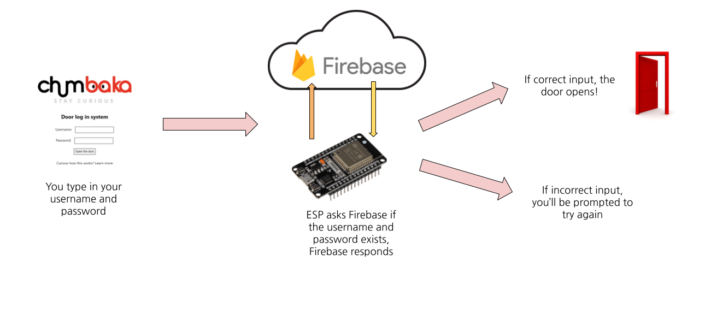

# ChumbakaDoorOpener
A project to make Chumbaka Kuching's workspace more accessible!

**NOTE**: to run this code using the Arduino IDE , save the two esp code files in the same folder, and change the .cpp filename on main to .ino, and also delete the line that says #include <Arduino.h>

This project uses an **ESP32**, a microcontroller (like an Arduino) that is able to connect to the internet.  The ESP32 is acting as a **webserver**, meaning that it's displaying a website.  In our case, by connecting to the same wifi as it (this is why you need to connect to ChumbakaWifi), and looking up it's IP address (a unique identification number for users on a WIFI network), you are able to view and interact with the website.  When you type your username and password into the website and hit submit, the ESP32 checks the inputs with the correct values it has stored in a **database** (I'm using Firebase for this project), and displays the correct or incorrect password message depending on your input.  If the input is correct, the ESP32 turns one of it's pins HIGH (using digitalWrite just like you would do on an Arduino).  This pin is connected to the pin in the building's electronic door opening mechanism, and unlocks the door for you!

Here's a little diagram:



If you're curious about how the code works, you can check out the files here, and I'll leave some notes about the important arts of the code below:
```
void loop() {
  server.handleClient(); //this needs to be called to keep the server running
}
```
